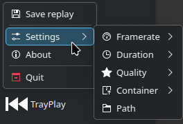

# TrayPlay
## A simple tray app for recording screen replays on KDE.


Simple frontend for [gpu-screen-recorder](https://git.dec05eba.com/gpu-screen-recorder/about)'s replay feature running in the background. Smaller alternative for [gpu-screen-recorder-ui](https://git.dec05eba.com/gpu-screen-recorder-ui/about/). Makes use of [Global Shortcuts](https://flatpak.github.io/xdg-desktop-portal/docs/doc-org.freedesktop.portal.GlobalShortcuts.html) and KDE OSDs. Replays are put into directories named after currently focused fullscreen app. If the active window isn't fullscreen videos are put into "unknown" directory.

> [!NOTE]
> This app currently ONLY works on KDE Plasma.

## Installing
Install the package from AUR: https://aur.archlinux.org/packages/trayplay

## Configuration
You can configure TrayPlay through its tray menu or directly with a config file which gets saved after the first start at `/home/username/.config/trayplay.toml` (or other directory set in $XDG_CONFIG_HOME)

```toml
# directly passed to gpu-screen-recorder as -w option
screen = "screen"

# mkv, mp4, flv or webm
container = "mkv"

# directly passed to gpu-screen-recorder as multiple -a options
audio_tracks = ["default_output", "default_input"]

# framerate of the video
framerate = 60

# clear replay buffer in memory when saving replay so that the next replay doesn't "overlap" with the previous one
clear_buffer_on_save = true

# medium, high, very_high or utra
quality = "ultra"

# directory where replays will be saved
replay_directory = "/home/username/Videos"

# max duration of a single replay
replay_duration_secs = 180
```
