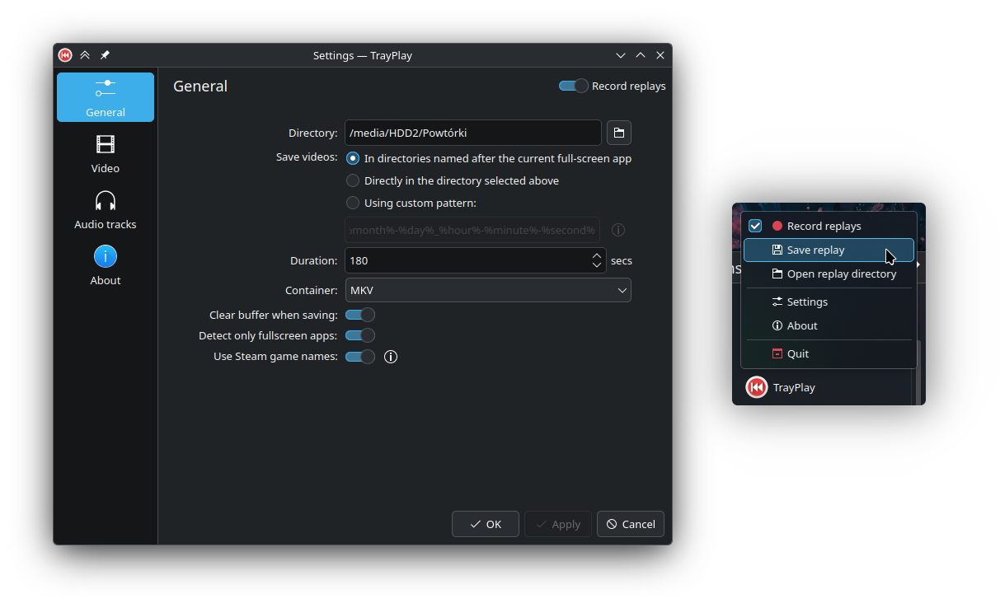

# TrayPlay
## A simple tray app for recording screen replays on KDE.


Frontend for [gpu-screen-recorder](https://git.dec05eba.com/gpu-screen-recorder/about)'s replay feature running in the background. More native-feeling alternative for [gpu-screen-recorder-ui](https://git.dec05eba.com/gpu-screen-recorder-ui/about/). Makes use of [Global Shortcuts](https://flatpak.github.io/xdg-desktop-portal/docs/doc-org.freedesktop.portal.GlobalShortcuts.html) and KDE OSDs.

> [!NOTE]
> This app is currently only supported on KDE Plasma (may work on other desktops but it's not guaranteed) and has been tested only on Wayland. I will not provide support or bug fixes for X11 or other desktops, but pull requests with fixes are welcome.

## Main Features
- Native integration with KDE Plasma
- Tray-based controls
- Global keyboard shortcuts for saving and toggling replay recording
- Customizable output directory and file naming
- Automatic clip naming based on the active app, window title, or Steam game
- Flexible audio track configuration
- HDR recording

## Installing
### Arch Linux (and derivatives)
TrayPlay is available on the AUR as a [normal](https://aur.archlinux.org/packages/trayplay) and [binary](https://aur.archlinux.org/packages/trayplay-bin) package.

If you're using yay you can install TrayPlay using the following command:  
`yay -S trayplay-bin`

### Other distros via Flatpak (experimental)
Since version 2.0 experimental Flatpak support has been added. Currently, it's not available on Flathub
as I want to iron it out before publishing it there. You can download a `.flatpak` file from the [Releases](https://github.com/kabuspl/trayplay/releases) tab.
You can install it by opening it in your distro's software center or via CLI:
```sh
flatpak --user install <file_name>.flatpak
```
> [!WARNING]
> Flatpak installed that way doesn't update automatically. You have to download the new `.flatpak` manually.

### Build from source
Install [rust toolchain](https://www.rust-lang.org/tools/install), [gpu-screen-recorder](https://git.dec05eba.com/gpu-screen-recorder/about/#:~:text=games.-,Installation) and other dependencies. For example on Arch Linux:
```sh
sudo pacman -S --needed base-devel rust cargo qt6-tools kirigami gettext gpu-screen-recorder xdg-desktop-portal-kde
```
Clone and build TrayPlay:
```sh
git clone https://github.com/kabuspl/trayplay.git
cd trayplay
cargo build --release
```
Executable will be located at `target/release/trayplay`. `dist/kwin_script.js` needs to be placed in `dist` directory relative to current working directory when starting trayplay or at `/usr/share/trayplay/kwin_script.js`.
To install it system-wide you can execute:
```sh
sudo install -Dm755 target/release/trayplay /usr/local/bin/trayplay
sudo install -Dm644 dist/kwin_script.js /usr/share/trayplay/kwin_script.js
sudo install -Dm644 dist/ovh.kabus.TrayPlay.desktop /usr/local/share/applications/ovh.kabus.TrayPlay.desktop
sudo install -Dm644 dist/ovh.kabus.TrayPlay.svg /usr/local/share/icons/hicolor/scalable/apps/ovh.kabus.TrayPlay.svg
sudo find locale -type f -exec install -Dm644 "{}" "/usr/local/share/{}" \;
```

## Configuration
You can configure TrayPlay through its settings menu or directly with a config file which gets saved after the first start at `/home/username/.config/trayplay.toml` (or other directory set in $XDG_CONFIG_HOME)

```toml
# start recording immediately
recording_enabled = true

# directly passed to gpu-screen-recorder as -w option
screen = "screen"

# mkv, mp4, flv or webm
container = "mkv"

# h264, hevc, av1, vp8, vp9, hevc_hdr, av1_hdr, hevc_10bit or av1_10bit
codec = "h264"

# directly passed to gpu-screen-recorder as multiple -a options
audio_tracks = ["default_output", "default_input"]

# framerate of the video
framerate = 60

# clear replay buffer in memory when saving replay so that the next replay doesn't "overlap" with the previous one
clear_buffer_on_save = true

# medium, high, very_high or ultra
quality = "ultra"

# directory where replays will be saved
replay_directory = "/home/username/Videos"

# max duration of a single replay
replay_duration_secs = 180

# replay file naming pattern - available variables:
# %app% - title of the current full-screen window or unknown
# %year% - current year
# %month% - current month
# %day% - current day
# %hour% - current hour
# %minute% - current minute
# %second% - current second
# file extension is added automatically based on video container
file_name_pattern = "%app%/%app%_replay_%year%-%month%-%day%_%hour%-%minute%-%second%"

# only fullscreen windows affect naming video files
detect_only_fullscreen_apps = true

# use steam app name for video naming instead of just window title for steam games
use_steam_game_names = true
```

## Contributing
Feel free to open issues or pull requests.

### Translating
Translations use GNU gettext.

Quick start guide:
1. Install gettext (`xgettext`, `msgmerge`, and `msgfmt`).
2. Create a directory for your language, for example `po/de/`.
3. Copy the template:
    ```sh
    cp po/trayplay.pot po/de/trayplay.po
    ```
4. Edit `po/de/trayplay.po` in a gettext editor such as Lokalize or Poedit.
   Update its header, including `Language` and `Plural-Forms`.
5. Validate the translation:
    ```sh
    mkdir -p locale/de/LC_MESSAGES
    msgfmt --check po/de/trayplay.po -o locale/de/LC_MESSAGES/trayplay.mo
    ```

Only include .po files in the pull request, .mo files are generated during compilation.
